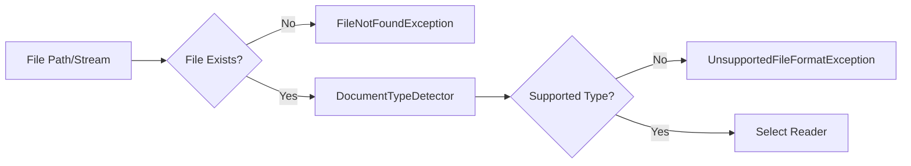
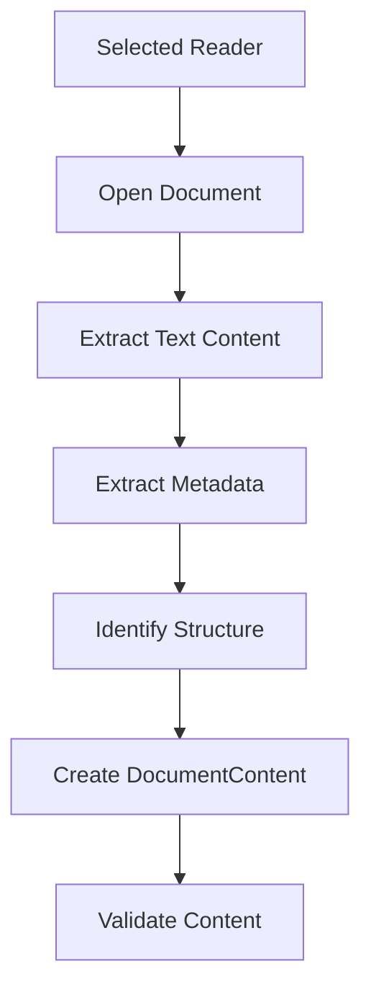

# FileFlux 아키텍처 가이드

> FileFlux 문서 처리 라이브러리의 포괄적인 아키텍처 개요

## 🎯 설계 원칙

### 1. **클린 아키텍처**
FileFlux는 명확한 관심사 분리를 통한 클린 아키텍처 원칙을 따릅니다:
- **도메인 레이어**: 핵심 모델과 인터페이스
- **애플리케이션 레이어**: 처리 오케스트레이션 및 비즈니스 로직
- **인프라스트럭처 레이어**: 리더, 전략 및 구조화 전략의 구체적인 구현

### 2. **선택적 AI 통합** (Phase 5)
- 외부 AI 서비스 의존성 없음 (FileFlux 코어)
- 소비 애플리케이션에서 LLM 구현 선택 (OpenAI, Azure, Anthropic 등)
- 프롬프트 생성과 실행의 분리
- 내부 프롬프트 템플릿 엔진 제공

### 3. **확장성 우선**
- 인터페이스 중심 설계
- 청킹 알고리즘을 위한 전략 패턴
- 문서 리더를 위한 팩토리 패턴
- 문서 구조화 전략을 위한 팩토리 패턴
- 커스텀 확장을 위한 플러그인 아키텍처

### 4. **성능 지향**
- 대용량 파일을 위한 스트리밍 지원
- 메모리 효율적인 처리
- 가능한 지연 평가
- 전체적인 취소 토큰 지원
- 비동기 스트림 처리 (AsyncStreamDocumentProcessor)

---

## 🏗️ System Architecture

### High-Level Architecture Diagram (Phase 5)

```mermaid
graph TB
    A[Client Application] --> B[IDocumentProcessor]
    A --> IDP[IIntelligentDocumentProcessor]
    
    B --> C[DocumentProcessor]
    B --> ODP[OptimizedDocumentProcessor]
    IDP --> AIDP[IntelligentDocumentProcessor]
    
    C --> D[IDocumentReader Factory]
    C --> E[IChunkingStrategy Factory]
    AIDP --> D
    AIDP --> F[IDocumentStructuringStrategy Factory]
    AIDP --> PTE[IPromptTemplateEngine]
    
    D --> G[TextDocumentReader]
    D --> H[JsonDocumentReader]
    D --> I[CsvDocumentReader]
    
    E --> J[FixedSizeChunkingStrategy]
    E --> K[SemanticChunkingStrategy]
    E --> L[ParagraphChunkingStrategy]
    E --> M[IntelligentChunkingStrategy]
    
    F --> N[TechnicalDocumentStructuringStrategy]
    F --> O[StructuredDataStructuringStrategy]
    
    PTE --> PT[InternalPromptTemplateEngine]
    
    A --> LLM[ILlmProvider - Client Implementation]
    AIDP --> LLM
    
    C --> P[DocumentContent]
    AIDP --> SC[StructuredContent]
    P --> Q[DocumentChunk[]]
    SC --> Q
    
    style A fill:#e1f5fe
    style B fill:#f3e5f5
    style IDP fill:#e8f5e8
    style AIDP fill:#e8f5e8
    style F fill:#ffebee
    style LLM fill:#fff3e0
    style Q fill:#e8f5e8
```

### Component Layers (Phase 5 Enhanced)

```
┌─────────────────────────────────────────────────────┐
│                 Client Layer                        │
│  • Application Code                                 │
│  • RAG Systems Integration                         │
│  • LLM Provider Implementation (OpenAI, Azure)     │
│  • Service Registrations                           │
├─────────────────────────────────────────────────────┤
│              Abstraction Layer                      │
│  • IDocumentProcessor                               │
│  • IIntelligentDocumentProcessor (Phase 5)         │
│  • IDocumentReader                                  │
│  • IChunkingStrategy                                │
│  • IDocumentStructuringStrategy (Phase 5)          │
│  • ILlmProvider (Phase 5)                          │
│  • IPromptTemplateEngine (Phase 5)                 │
├─────────────────────────────────────────────────────┤
│               Core Layer                            │
│  • DocumentProcessor (Basic Orchestrator)          │
│  • OptimizedDocumentProcessor (Performance)        │
│  • IntelligentDocumentProcessor (AI-Enhanced)      │
│  • DocumentReaderFactory                           │
│  • ChunkingStrategyFactory                         │
│  • DocumentStructuringStrategyFactory (Phase 5)    │
│  • DocumentTypeDetector                            │
├─────────────────────────────────────────────────────┤
│            Implementation Layer                     │
│  • Document Readers (Text, JSON, CSV)             │
│  • Chunking Strategies (Fixed, Semantic, etc.)    │
│  • Structuring Strategies (Technical, Data)        │
│  • Internal Prompt Template Engine (Phase 5)      │
│  • Text Processing Utilities                       │
├─────────────────────────────────────────────────────┤
│               Model Layer                           │
│  • DocumentContent                                 │
│  • DocumentChunk                                   │
│  • DocumentMetadata                                │
│  • ChunkingOptions                                 │
│  • ProcessingOptions (Phase 5)                     │
│  • SectionInfo (Phase 5)                           │
│  • StructuredContent (Phase 5)                     │
└─────────────────────────────────────────────────────┘
```

---

## 🧠 Phase 5: Intelligent Processing Components

### 1. IIntelligentDocumentProcessor (AI-Enhanced Interface)

```csharp
public interface IIntelligentDocumentProcessor
{
    // Basic processing (non-AI)
    Task<IEnumerable<DocumentChunk>> ProcessAsync(
        string documentPath,
        ProcessingOptions? options = null,
        CancellationToken cancellationToken = default);

    // Intelligent processing with LLM
    Task<IEnumerable<DocumentChunk>> ProcessIntelligentlyAsync(
        string documentPath,
        ProcessingOptions? options = null,
        CancellationToken cancellationToken = default);

    // Structure-aware processing
    Task<StructuredContent> AnalyzeStructureAsync(
        string documentPath,
        ProcessingOptions? options = null,
        CancellationToken cancellationToken = default);
        
    // Utility methods
    Task<(DocumentType type, double confidence)> DetectDocumentTypeAsync(
        string documentPath,
        CancellationToken cancellationToken = default);
}
```

**Key Features:**
- LLM-powered document structure analysis
- Intelligent content extraction with context awareness
- Document type detection with confidence scoring
- Flexible processing options for different use cases

### 2. IDocumentStructuringStrategy (Document-Type Specific Processing)

```csharp
public interface IDocumentStructuringStrategy
{
    DocumentType SupportedDocumentType { get; }
    
    Task<StructuredContent> AnalyzeStructureAsync(
        DocumentContent content,
        ProcessingOptions options,
        ILlmProvider? llmProvider = null,
        CancellationToken cancellationToken = default);
        
    Task<(DocumentType detectedType, double confidence)> DetectDocumentTypeAsync(
        string content,
        string fileName,
        CancellationToken cancellationToken = default);
}
```

**Implemented Strategies:**
- **TechnicalDocumentStructuringStrategy**: Handles markdown, text files with headers, paragraphs, code blocks, lists, tables
- **StructuredDataStructuringStrategy**: Handles JSON, CSV with schema detection and record extraction

### 3. ILlmProvider (Client-Implemented Interface)

```csharp
public interface ILlmProvider
{
    Task<StructureAnalysisResult> AnalyzeStructureAsync(
        string prompt,
        string content,
        CancellationToken cancellationToken = default);
}

public class StructureAnalysisResult
{
    public string DocumentType { get; set; } = string.Empty;
    public double Confidence { get; set; }
    public List<SectionInfo> Sections { get; set; } = [];
    public Dictionary<string, object> Metadata { get; set; } = [];
}
```

**Separation of Concerns:**
- FileFlux generates prompts and coordinates processing
- Client applications provide LLM implementation (OpenAI, Azure, Anthropic)
- Clean architecture with no AI service dependencies in FileFlux core

### 4. Internal Prompt Template Engine

```csharp
public interface IPromptTemplateEngine
{
    string GenerateStructureAnalysisPrompt(string documentType, string content);
    string GenerateTypeDetectionPrompt(string fileName, string contentPreview);
}
```

**Built-in Templates:**
- Document structure analysis prompts
- Type detection prompts
- Extensible template system for custom scenarios

### 5. Enhanced Models (Phase 5)

```csharp
public class ProcessingOptions
{
    public bool UseIntelligentProcessing { get; set; } = false;
    public DocumentType? ExpectedDocumentType { get; set; }
    public ChunkingOptions? ChunkingOptions { get; set; }
    public bool DetectDocumentType { get; set; } = true;
    public double TypeDetectionThreshold { get; set; } = 0.7;
    public Dictionary<string, object> StrategyOptions { get; set; } = [];
}

public class SectionInfo
{
    public string Title { get; set; } = string.Empty;
    public string Content { get; set; } = string.Empty;
    public SectionType Type { get; set; }
    public int Level { get; set; }
    public Dictionary<string, object> Properties { get; set; } = [];
}

public enum SectionType
{
    HEADING_L1, HEADING_L2, HEADING_L3, HEADING_L4, HEADING_L5, HEADING_L6,
    PARAGRAPH, CODE_BLOCK, LIST, TABLE, SCHEMA, RECORD
}

public class StructuredContent
{
    public string Title { get; set; } = string.Empty;
    public DocumentType DocumentType { get; set; }
    public double TypeConfidence { get; set; }
    public List<SectionInfo> Sections { get; set; } = [];
    public DocumentMetadata Metadata { get; set; } = new();
}
```

---

## 🔧 Core Components

### 1. IDocumentProcessor (Main Interface)

```csharp
public interface IDocumentProcessor
{
    // Primary processing methods
    Task<IEnumerable<DocumentChunk>> ProcessAsync(
        string documentPath, 
        ChunkingOptions? options = null,
        CancellationToken cancellationToken = default);
    
    Task<IEnumerable<DocumentChunk>> ProcessAsync(
        Stream documentStream, 
        string fileName,
        ChunkingOptions? options = null,
        CancellationToken cancellationToken = default);
    
    // Utility methods
    bool CanProcess(string filePath);
    IEnumerable<string> SupportedExtensions { get; }
}
```

**Responsibilities:**
- Main entry point for all document processing
- Orchestrates the entire processing pipeline
- Handles different input types (file path, stream)
- Manages error handling and validation

### 2. DocumentProcessor (Orchestrator)

```csharp
public class DocumentProcessor : IDocumentProcessor
{
    private readonly IDocumentReaderFactory _readerFactory;
    private readonly IChunkingStrategyFactory _strategyFactory;
    private readonly DocumentTypeDetector _typeDetector;
    
    public async Task<IEnumerable<DocumentChunk>> ProcessAsync(
        string documentPath, 
        ChunkingOptions? options = null,
        CancellationToken cancellationToken = default)
    {
        // 1. Validate input
        ValidateInput(documentPath, options);
        
        // 2. Detect document type
        var fileType = _typeDetector.DetectType(documentPath);
        
        // 3. Get appropriate reader
        var reader = _readerFactory.GetReader(fileType);
        
        // 4. Read document content
        var content = await reader.ReadAsync(documentPath, cancellationToken);
        
        // 5. Get chunking strategy
        var strategy = _strategyFactory.GetStrategy(options?.Strategy ?? "Context7");
        
        // 6. Apply chunking strategy
        var chunks = await strategy.ChunkAsync(content, options ?? new ChunkingOptions(), cancellationToken);
        
        // 7. Post-process chunks
        return PostProcessChunks(chunks, content.Metadata);
    }
}
```

**Responsibilities:**
- Coordinates the processing pipeline
- Manages factory instances
- Handles common error scenarios
- Applies post-processing logic

### 3. IDocumentReader (Content Extraction)

```csharp
public interface IDocumentReader
{
    Task<DocumentContent> ReadAsync(string filePath, CancellationToken cancellationToken = default);
    Task<DocumentContent> ReadAsync(Stream stream, string fileName, CancellationToken cancellationToken = default);
    bool CanRead(string fileName);
    IEnumerable<string> SupportedExtensions { get; }
}
```

**Concrete Implementations:**

#### PdfReader
```csharp
public class PdfReader : IDocumentReader
{
    public async Task<DocumentContent> ReadAsync(string filePath, CancellationToken cancellationToken = default)
    {
        using var document = PdfDocument.Open(filePath);
        
        var textBuilder = new StringBuilder();
        var sections = new List<DocumentSection>();
        
        foreach (var page in document.GetPages())
        {
            var text = ContentOrderTextExtractor.GetText(page);
            textBuilder.AppendLine(text);
            
            sections.Add(new DocumentSection
            {
                Title = $"Page {page.Number}",
                Content = text,
                Type = SectionType.Page,
                Properties = new Dictionary<string, object>
                {
                    ["PageNumber"] = page.Number,
                    ["PageSize"] = new { page.Width, page.Height }
                }
            });
        }
        
        return new DocumentContent
        {
            Text = textBuilder.ToString(),
            Sections = sections,
            Metadata = ExtractMetadata(document, filePath)
        };
    }
}
```

#### WordReader
```csharp
public class WordReader : IDocumentReader
{
    public async Task<DocumentContent> ReadAsync(string filePath, CancellationToken cancellationToken = default)
    {
        using var document = WordprocessingDocument.Open(filePath, false);
        var body = document.MainDocumentPart.Document.Body;
        
        var textBuilder = new StringBuilder();
        var sections = new List<DocumentSection>();
        
        foreach (var paragraph in body.Descendants<Paragraph>())
        {
            var text = paragraph.InnerText;
            if (string.IsNullOrWhiteSpace(text)) continue;
            
            textBuilder.AppendLine(text);
            
            // Detect if paragraph is a heading
            var isHeading = IsHeading(paragraph);
            sections.Add(new DocumentSection
            {
                Title = isHeading ? text : $"Paragraph {sections.Count + 1}",
                Content = text,
                Type = isHeading ? SectionType.Heading : SectionType.Paragraph,
                Level = GetHeadingLevel(paragraph)
            });
        }
        
        return new DocumentContent
        {
            Text = textBuilder.ToString(),
            Sections = sections,
            Metadata = ExtractMetadata(document, filePath)
        };
    }
}
```

### 4. IChunkingStrategy (Content Splitting)

```csharp
public interface IChunkingStrategy
{
    Task<IEnumerable<DocumentChunk>> ChunkAsync(
        DocumentContent content, 
        ChunkingOptions options,
        CancellationToken cancellationToken = default);
    
    string StrategyName { get; }
    ChunkingOptions DefaultOptions { get; }
}
```

**Strategy Implementations:**

#### Context7Strategy (Recommended)
```csharp
public class Context7Strategy : IChunkingStrategy
{
    public string StrategyName => "Context7";
    
    public async Task<IEnumerable<DocumentChunk>> ChunkAsync(
        DocumentContent content, 
        ChunkingOptions options,
        CancellationToken cancellationToken = default)
    {
        var chunks = new List<DocumentChunk>();
        var sentences = SentenceTokenizer.Tokenize(content.Text);
        
        var currentChunk = new StringBuilder();
        var currentTokenCount = 0;
        var chunkIndex = 0;
        
        foreach (var sentence in sentences)
        {
            var sentenceTokenCount = TokenCounter.Count(sentence);
            
            // Check if adding this sentence exceeds the limit
            if (currentTokenCount + sentenceTokenCount > options.MaxChunkSize && currentChunk.Length > 0)
            {
                // Create chunk with overlap
                var chunkContent = currentChunk.ToString().Trim();
                var chunk = CreateChunk(chunkContent, chunkIndex, content.Metadata);
                chunks.Add(chunk);
                
                // Start new chunk with overlap
                currentChunk = CreateOverlapBuffer(chunkContent, options.OverlapSize);
                currentTokenCount = TokenCounter.Count(currentChunk.ToString());
                chunkIndex++;
            }
            
            currentChunk.AppendLine(sentence);
            currentTokenCount += sentenceTokenCount;
        }
        
        // Add final chunk
        if (currentChunk.Length > 0)
        {
            var finalChunk = CreateChunk(currentChunk.ToString().Trim(), chunkIndex, content.Metadata);
            chunks.Add(finalChunk);
        }
        
        return chunks;
    }
}
```

#### SemanticStrategy
```csharp
public class SemanticStrategy : IChunkingStrategy
{
    public string StrategyName => "Semantic";
    
    public async Task<IEnumerable<DocumentChunk>> ChunkAsync(
        DocumentContent content, 
        ChunkingOptions options,
        CancellationToken cancellationToken = default)
    {
        if (options.PreserveStructure && content.Sections.Any())
        {
            return await ChunkBySections(content, options, cancellationToken);
        }
        
        return await ChunkBySentences(content, options, cancellationToken);
    }
    
    private async Task<IEnumerable<DocumentChunk>> ChunkBySections(
        DocumentContent content, 
        ChunkingOptions options,
        CancellationToken cancellationToken)
    {
        var chunks = new List<DocumentChunk>();
        
        foreach (var section in content.Sections)
        {
            if (section.Type == SectionType.Heading)
            {
                // Keep headings with next content section
                continue;
            }
            
            var sectionChunks = await ChunkSectionContent(section, options, cancellationToken);
            chunks.AddRange(sectionChunks);
        }
        
        return chunks;
    }
}
```

---

## 🔄 Processing Pipeline

### Phase 5: Intelligent Processing Pipeline

```mermaid
graph TD
    A[Document Input] --> B{Processing Mode}
    B -->|Basic| C[Basic Processing Pipeline]
    B -->|Intelligent| D[AI-Enhanced Pipeline]
    
    C --> E[Document Reader]
    C --> F[Chunking Strategy]
    C --> G[DocumentChunk[]]
    
    D --> H[Document Reader]
    D --> I[Document Type Detection]
    I --> J[Structure Analysis Strategy]
    J --> K{LLM Available?}
    K -->|Yes| L[LLM Structure Analysis]
    K -->|No| M[Rule-based Analysis]
    L --> N[StructuredContent]
    M --> N
    N --> O[Intelligent Chunking]
    O --> P[Enhanced DocumentChunk[]]
    
    style D fill:#e8f5e8
    style L fill:#fff3e0
    style N fill:#ffebee
    style P fill:#e8f5e8
```

### 1. Input Validation & Type Detection



### 2. Content Extraction Phase



### 3. Chunking Phase

```mermaid
graph TD
    A[DocumentContent] --> B[Select Strategy]
    B --> C{Strategy Type}
    C -->|Context7| D[Sentence-based chunking]
    C -->|Semantic| E[Structure-aware chunking]
    C -->|FixedSize| F[Token-based chunking]
    C -->|Paragraph| G[Paragraph-based chunking]
    
    D --> H[Apply Overlap]
    E --> H
    F --> H
    G --> H
    
    H --> I[Generate Metadata]
    I --> J[Create DocumentChunk[]]
```

### 4. Post-processing & Output

```mermaid
graph LR
    A[DocumentChunk[]] --> B[Validate Chunks]
    B --> C[Enrich Metadata]
    C --> D[Apply Numbering]
    D --> E[Final Validation]
    E --> F[Return Results]
```

---

## 🏭 Factory Patterns

### DocumentReaderFactory

```csharp
public interface IDocumentReaderFactory
{
    IDocumentReader GetReader(DocumentType type);
    IDocumentReader GetReader(string fileName);
    bool CanHandle(string fileName);
    IEnumerable<IDocumentReader> GetAllReaders();
}

public class DocumentReaderFactory : IDocumentReaderFactory
{
    private readonly IEnumerable<IDocumentReader> _readers;
    
    public DocumentReaderFactory(IEnumerable<IDocumentReader> readers)
    {
        _readers = readers;
    }
    
    public IDocumentReader GetReader(string fileName)
    {
        var reader = _readers.FirstOrDefault(r => r.CanRead(fileName));
        return reader ?? throw new UnsupportedFileFormatException(fileName);
    }
}
```

### ChunkingStrategyFactory

```csharp
public interface IChunkingStrategyFactory
{
    IChunkingStrategy GetStrategy(string strategyName);
    IEnumerable<IChunkingStrategy> GetAllStrategies();
    IEnumerable<string> GetAvailableStrategyNames();
}

public class ChunkingStrategyFactory : IChunkingStrategyFactory
{
    private readonly IEnumerable<IChunkingStrategy> _strategies;
    private readonly Dictionary<string, IChunkingStrategy> _strategyMap;
    
    public ChunkingStrategyFactory(IEnumerable<IChunkingStrategy> strategies)
    {
        _strategies = strategies;
        _strategyMap = strategies.ToDictionary(s => s.StrategyName, StringComparer.OrdinalIgnoreCase);
    }
    
    public IChunkingStrategy GetStrategy(string strategyName)
    {
        if (_strategyMap.TryGetValue(strategyName, out var strategy))
        {
            return strategy;
        }
        
        // Default fallback
        return _strategyMap["Context7"];
    }
}
```

---

## 🎛️ Configuration & Options

### ChunkingOptions Model

```csharp
public class ChunkingOptions
{
    // Strategy selection
    public string Strategy { get; set; } = "Context7";
    
    // Size constraints
    public int MaxChunkSize { get; set; } = 1024;
    public int MinChunkSize { get; set; } = 100;
    public int OverlapSize { get; set; } = 128;
    
    // Processing options
    public bool PreserveStructure { get; set; } = true;
    public bool IncludeMetadata { get; set; } = true;
    public bool RemoveExtraWhitespace { get; set; } = true;
    
    // Strategy-specific options
    public Dictionary<string, object> StrategyOptions { get; set; } = new();
    
    // Validation
    public void Validate()
    {
        if (MaxChunkSize < MinChunkSize)
            throw new ArgumentException("MaxChunkSize must be greater than MinChunkSize");
            
        if (OverlapSize >= MaxChunkSize)
            throw new ArgumentException("OverlapSize must be less than MaxChunkSize");
    }
}
```

### Dependency Injection Configuration (Phase 5)

```csharp
public static class ServiceCollectionExtensions
{
    public static IServiceCollection AddFileFlux(
        this IServiceCollection services, 
        Action<FileFluxOptions>? configureOptions = null)
    {
        // Configure options
        var options = new FileFluxOptions();
        configureOptions?.Invoke(options);
        services.AddSingleton(options);

        // Basic chunking options
        services.AddSingleton(provider =>
        {
            var fileFluxOptions = provider.GetRequiredService<FileFluxOptions>();
            return fileFluxOptions.DefaultChunkingOptions ?? new ChunkingOptions();
        });

        // Core services (performance optimized versions)
        services.AddScoped<IDocumentProcessor, OptimizedDocumentProcessor>();
        services.AddScoped<DocumentProcessor>();
        services.AddScoped<AsyncStreamDocumentProcessor>();

        // Phase 5: Intelligent document processing services
        services.AddScoped<IIntelligentDocumentProcessor, IntelligentDocumentProcessor>();
        
        // Phase 5: Internal prompt template engine
        services.AddFileFluxPromptEngine();

        // Factories
        services.AddSingleton<IDocumentReaderFactory>(provider => 
        {
            var factory = new DocumentReaderFactory();
            RegisterDefaultReaders(factory, provider);
            return factory;
        });

        services.AddSingleton<IChunkingStrategyFactory>(provider =>
        {
            var factory = new ChunkingStrategyFactory();
            RegisterDefaultStrategies(factory, provider);
            return factory;
        });

        // Phase 5: Document structuring strategy factory
        services.AddSingleton<IDocumentStructuringStrategyFactory>(provider =>
        {
            var factory = new DocumentStructuringStrategyFactory(provider);
            RegisterDefaultStructuringStrategies(factory, provider);
            return factory;
        });

        // Register readers (currently implemented)
        services.TryAddTransient<TextDocumentReader>();
        services.TryAddTransient<JsonDocumentReader>();
        services.TryAddTransient<CsvDocumentReader>();

        // Register chunking strategies
        services.TryAddTransient<FixedSizeChunkingStrategy>();
        services.TryAddTransient<SemanticChunkingStrategy>();
        services.TryAddTransient<ParagraphChunkingStrategy>();
        services.TryAddTransient<IntelligentChunkingStrategy>();
        
        // Phase 5: Default IChunkingStrategy for structuring strategies
        services.TryAddTransient<IChunkingStrategy>(provider => 
            provider.GetRequiredService<IntelligentChunkingStrategy>());

        // Phase 5: Document structuring strategies
        services.TryAddTransient<TechnicalDocumentStructuringStrategy>();
        services.TryAddTransient<StructuredDataStructuringStrategy>();

        return services;
    }
    
    // Phase 5: Internal prompt template engine registration
    public static IServiceCollection AddFileFluxPromptEngine(
        this IServiceCollection services)
    {
        services.AddSingleton<IPromptTemplateEngine, InternalPromptTemplateEngine>();
        return services;
    }

    // Phase 5: Custom LLM provider registration (client responsibility)
    public static IServiceCollection AddLlmProvider<TProvider>(
        this IServiceCollection services,
        ServiceLifetime lifetime = ServiceLifetime.Scoped)
        where TProvider : class, ILlmProvider
    {
        services.Add(new ServiceDescriptor(typeof(ILlmProvider), typeof(TProvider), lifetime));
        return services;
    }
}

public class FileFluxOptions
{
    /// <summary>
    /// 기본 청킹 옵션
    /// </summary>
    public ChunkingOptions? DefaultChunkingOptions { get; set; }

    /// <summary>
    /// 성능 최적화 설정
    /// </summary>
    public PerformanceOptions Performance { get; set; } = new();

    /// <summary>
    /// 로깅 설정
    /// </summary>
    public LoggingOptions Logging { get; set; } = new();

    /// <summary>
    /// 캐싱 설정
    /// </summary>
    public CachingOptions Caching { get; set; } = new();
}

public class PerformanceOptions
{
    public int MaxConcurrency { get; set; } = Environment.ProcessorCount;
    public int BufferSize { get; set; } = 8192;
    public int MaxMemoryUsageMB { get; set; } = 500;
    public bool EnableStreamingProcessing { get; set; } = true;
}

public class LoggingOptions
{
    public bool EnableDetailedLogging { get; set; } = false;
    public bool EnablePerformanceLogging { get; set; } = false;
    public bool LogChunkCounts { get; set; } = true;
}

public class CachingOptions
{
    public bool EnableContentCaching { get; set; } = false;
    public bool EnableMetadataCaching { get; set; } = true;
    public int CacheExpirationMinutes { get; set; } = 30;
    public int MaxCacheItems { get; set; } = 100;
}
```

---

## 🚀 Performance Considerations

### Memory Management

1. **Streaming Support**
   - Use `Stream` overloads for large files
   - Implement `IDisposable` for resource cleanup
   - Use `ConfigureAwait(false)` for async operations

2. **Lazy Evaluation**
   - Return `IEnumerable<T>` instead of `List<T>`
   - Use `yield return` where appropriate
   - Implement chunking as streaming when possible

### Concurrency

1. **Thread Safety**
   - All public interfaces are thread-safe
   - Factories use immutable collections
   - No shared mutable state in processors

2. **Async Processing**
   - Full async/await support
   - Cancellation token propagation
   - Proper exception handling

### Scalability

1. **Resource Efficiency**
   - Minimal memory allocation
   - Efficient string handling
   - Reusable components where safe

---

## 🔌 Extension Points

### Custom Document Readers

```csharp
// 1. Implement IDocumentReader
public class CustomReader : IDocumentReader
{
    public IEnumerable<string> SupportedExtensions => [".custom"];
    
    public bool CanRead(string fileName) => 
        Path.GetExtension(fileName).Equals(".custom", StringComparison.OrdinalIgnoreCase);
    
    public async Task<DocumentContent> ReadAsync(string filePath, CancellationToken cancellationToken = default)
    {
        // Your implementation
    }
}

// 2. Register with DI
services.AddSingleton<IDocumentReader, CustomReader>();
```

### Custom Chunking Strategies

```csharp
// 1. Implement IChunkingStrategy
public class CustomChunkingStrategy : IChunkingStrategy
{
    public string StrategyName => "CustomStrategy";
    
    public ChunkingOptions DefaultOptions => new()
    {
        MaxChunkSize = 512,
        OverlapSize = 64
    };
    
    public async Task<IEnumerable<DocumentChunk>> ChunkAsync(
        DocumentContent content, 
        ChunkingOptions options,
        CancellationToken cancellationToken = default)
    {
        // Your chunking logic
    }
}

// 2. Register with DI
services.AddSingleton<IChunkingStrategy, CustomChunkingStrategy>();
```

### Plugin Architecture

```csharp
public interface IFileFluxPlugin
{
    string Name { get; }
    string Version { get; }
    void Initialize(IServiceCollection services);
}

public class PluginManager
{
    public void LoadPlugins(string pluginDirectory, IServiceCollection services)
    {
        var pluginAssemblies = Directory.GetFiles(pluginDirectory, "*.dll")
            .Select(Assembly.LoadFrom);
            
        foreach (var assembly in pluginAssemblies)
        {
            var pluginTypes = assembly.GetTypes()
                .Where(t => typeof(IFileFluxPlugin).IsAssignableFrom(t) && !t.IsInterface);
                
            foreach (var pluginType in pluginTypes)
            {
                var plugin = (IFileFluxPlugin)Activator.CreateInstance(pluginType);
                plugin.Initialize(services);
            }
        }
    }
}
```

---

## 🔍 Error Handling Strategy

### Exception Hierarchy

```csharp
public class FileFluxException : Exception
{
    public string? FileName { get; }
    
    protected FileFluxException(string message, string? fileName = null, Exception? innerException = null)
        : base(message, innerException)
    {
        FileName = fileName;
    }
}

public class UnsupportedFileFormatException : FileFluxException
{
    public UnsupportedFileFormatException(string fileName)
        : base($"Unsupported file format: {Path.GetExtension(fileName)}", fileName) { }
}

public class DocumentProcessingException : FileFluxException
{
    public DocumentProcessingException(string message, string fileName, Exception innerException)
        : base(message, fileName, innerException) { }
}

public class ChunkingException : FileFluxException
{
    public string StrategyName { get; }
    
    public ChunkingException(string message, string strategyName, string? fileName = null, Exception? innerException = null)
        : base(message, fileName, innerException)
    {
        StrategyName = strategyName;
    }
}
```

### Error Handling Patterns

```csharp
public class DocumentProcessor : IDocumentProcessor
{
    public async Task<IEnumerable<DocumentChunk>> ProcessAsync(
        string documentPath,
        ChunkingOptions? options = null,
        CancellationToken cancellationToken = default)
    {
        try
        {
            // Validate input
            if (string.IsNullOrWhiteSpace(documentPath))
                throw new ArgumentException("Document path cannot be null or empty", nameof(documentPath));
                
            if (!File.Exists(documentPath))
                throw new FileNotFoundException($"Document not found: {documentPath}");
            
            // Process document
            var content = await ReadDocumentContent(documentPath, cancellationToken);
            var chunks = await ApplyChunkingStrategy(content, options ?? new ChunkingOptions(), cancellationToken);
            
            return chunks;
        }
        catch (Exception ex) when (!(ex is FileFluxException))
        {
            throw new DocumentProcessingException(
                $"Failed to process document: {ex.Message}", 
                documentPath, 
                ex);
        }
    }
}
```

---

This architecture ensures FileFlux remains maintainable, extensible, and performant while providing a clean separation of concerns and maximum flexibility for various use cases.